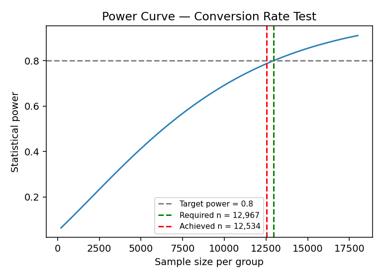
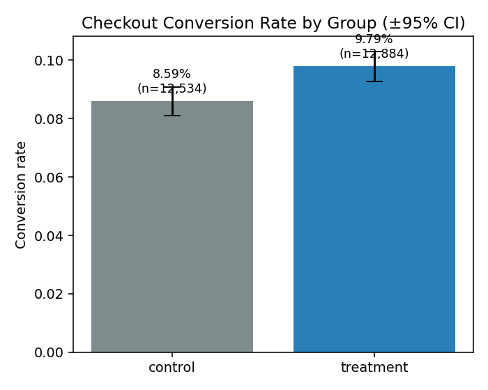
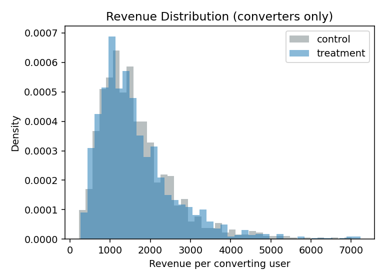
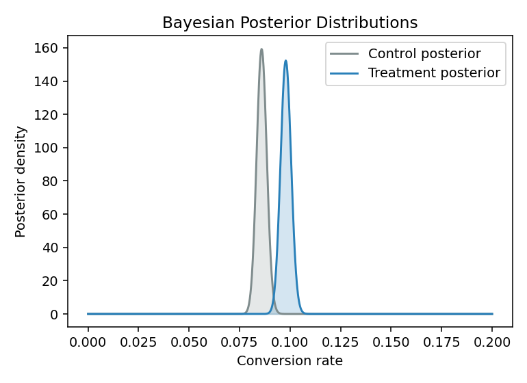

# A/B Test Report — Checkout Redesign Experiment

_Task 16: Hypothesis Testing & A/B Tests — Data Analyst, Phase 1 Industry Immersion_

## 1. Objective & Hypotheses (pipeline step 1)

**Business question:** Does the new one-page checkout flow (treatment) change checkout conversion rate and/or revenue per user compared to the current checkout (control)?

**Decision this informs:** whether to roll the new checkout out to 100% of traffic.

- **H1 (primary):** H0: conversion_treatment = conversion_control vs H1: they differ.
- **H2 (secondary):** H0: mean revenue/user is equal between groups vs H1: it differs.

Both hypotheses and the significance level (alpha = 0.05) were fixed **before** looking at the results, and a multiple-testing correction (Holm-Bonferroni) is applied across the two metrics to avoid p-hacking.

## 2. Test Selection & Justification (pipeline step 2)

- **Conversion rate** is a binary outcome at reasonably large sample size → **two-proportion z-test** is the standard, appropriate choice (a chi-square test of independence would give an equivalent result for 2x2 tables).
- **Revenue per user** is heavily right-skewed with a point-mass at 0 (non-converters). A **Welch's t-test** (robust to unequal variance, and valid asymptotically by the CLT even under skew at this sample size) is run as the primary parametric test, cross-checked against a **Mann-Whitney U test** (distribution-free, robust to the skew/outliers) — the alternative named explicitly in the study guide. Where they disagree, the non-parametric result is trusted more.
- As a further alternative, a **Bayesian Beta-Binomial model** is run on conversion rate alongside the frequentist test (see Section 5), giving a direct probability statement rather than a p-value — useful for stakeholder communication.

### Data Validation & Cleaning Summary
- Raw rows loaded: **25,805**
- Exact duplicate rows removed: **204**
- Cross-over (contaminated) users removed: **102**
- Negative / impossible revenue values removed: **3**
- Extreme outlier (bot-like) revenue rows removed: **78**
- Missing revenue values imputed as 0 (non-converters/no-charge): **34**
- Clean rows analysed: **25,418**
- Final group sizes: {'treatment': 12884, 'control': 12534}
- Sample Ratio Mismatch (SRM) check p-value: **0.0281** (OK, allocation looks as expected)
- Covariate balance (chi-square p-values across groups):
    - device: p = 0.2290 (OK)
    - country: p = 0.1998 (OK)
- Warnings:
    - 34 missing revenue value(s) for converters were imputed with the group's median converting order value (documented, not silently dropped).

## 3. Sample Size & Power Analysis (pipeline step 3)

**Conversion rate — a-priori power analysis**
- Baseline: 0.08593
- Minimum Detectable Effect (MDE): 0.01
- Standardized effect size: -0.0348
- alpha = 0.05, target power = 0.8
- **Required sample size per group: 12,967**
- Achieved sample size per group: 12,534 → UNDERPOWERED ⚠️
- Achieved (post-hoc) power at observed n: 0.787

**Revenue per user — a-priori power analysis**
- Baseline: 932.2
- Minimum Detectable Effect (MDE): 50
- Standardized effect size: 0.0536
- alpha = 0.05, target power = 0.8
- **Required sample size per group: 5,458**
- Achieved sample size per group: 12,534 → sufficiently powered ✅

## 4. Results — Frequentist Tests (pipeline steps 4–5)

#### Primary metric: Conversion Rate (Two-Proportion Z-Test)
- **H0/H1**: H0: p_treatment = p_control  vs  H1: p_treatment ≠ p_control
- Test statistic: 3.2950
- p-value (raw): 0.00098  |  Holm-adjusted: 0.00295
- Effect size (Cohen's h): 0.0414
- 95% CI on the difference: [0.0048, 0.0190]
- Significant at alpha=0.05: raw = True, after multiple-testing correction = True
- **Interpretation**: Control conversion = 8.5926% (n=12,534), Treatment conversion = 9.7873% (n=12,884). Absolute lift = +1.1947% (+13.90% relative). Statistically significant at alpha=0.05.

#### Secondary metric: Revenue per User — Welch's t-test
- **H0/H1**: H0: mean_revenue_treatment = mean_revenue_control  vs  H1: they differ
- Test statistic: 2.9863
- p-value (raw): 0.00283  |  Holm-adjusted: 0.00295
- Effect size (Cohen's d): 0.0374
- 95% CI on the difference: [6.9532, 34.2677]
- Significant at alpha=0.05: raw = True, after multiple-testing correction = True
- **Interpretation**: Mean revenue/user: control = 140.89, treatment = 161.76 (diff = +20.88). Distribution is right-skewed (skew: control=4.82, treatment=4.70), so this parametric result is cross-checked against the non-parametric test below before trusting it. Significant.

#### Secondary metric: Revenue per User — Mann-Whitney U (non-parametric)
- **H0/H1**: H0: distributions are identical  vs  H1: treatment revenue is stochastically greater/less
- Test statistic: 81704040.5000
- p-value (raw): 0.00106  |  Holm-adjusted: 0.00295
- Effect size (Rank-biserial correlation): -0.0119
- 95% CI on the difference: [0.0000, 0.0000]
- Significant at alpha=0.05: raw = True, after multiple-testing correction = True
- **Interpretation**: Median revenue/user: control = 0.00, treatment = 0.00. Rank-biserial effect size = -0.0119. Agrees with the t-test conclusion above. Significant.

## 5. Alternative Approach — Bayesian A/B Test

#### Alternative approach: Bayesian Beta-Binomial model (conversion rate)
- Prior: Beta(1.0, 1.0) (weakly informative, uniform-ish)
- Posterior control: Beta(1078.0, 11458.0)
- Posterior treatment: Beta(1262.0, 11624.0)
- **P(treatment conversion > control conversion) = 0.9996**
- 95% credible interval on the difference (treatment - control): [0.0048, 0.0191]
- Expected loss from choosing treatment if wrong: 0.00000
- Reading: the frequentist p-value answers 'how surprising is this data if there's truly no effect', while this gives a direct probability statement about which variant is actually better — useful for explaining the decision to a non-technical stakeholder.

## 6. Recommendation (pipeline step 6)

## Recommendation: SHIP the treatment (new checkout flow).

**Rationale:**
- Conversion rate: +1.195% absolute change, Holm-adjusted p=0.0030 (significant after correcting for testing 2 metrics).
- Bayesian check: P(treatment beats control) = 100.0%, expected loss from shipping treatment if wrong = 0.0000 — the two frameworks broadly agree.
- Practical significance check: effect size (Cohen's h=0.041) is above the minimum business-relevant threshold (0.02).
- Revenue per user: t-test p=0.0030, Mann-Whitney p=0.0030 (both agree).
- Both statistical AND practical significance criteria are met, and the effect is positive.

**Caveats / what would change this recommendation:**
- No major data-quality red flags found in validation; recommendation is reasonably trustworthy.

## 7. Pitfalls Explicitly Checked

- **p-hacking:** hypotheses & alpha fixed up front (Section 1); Holm-Bonferroni correction applied across the 2 metrics tested; no repeated peeking.
- **Significant-but-trivial effects:** practical-significance threshold applied on top of statistical significance in the Recommendation section.
- **Unequal / contaminated groups:** Sample Ratio Mismatch test, cross-over contamination removal, and covariate-balance checks all run in Section 2's data validation summary.

## 8. Confounds & Deeper Questions

- Could device mix, country mix, or time-of-experiment (e.g. a promo mid-experiment) explain the difference instead of the checkout redesign? → checked via the covariate balance test above; re-run with stratification if imbalance is flagged.
- Is the effect size large enough to justify the engineering cost of shipping the new checkout? → addressed explicitly via the practical-significance threshold.
- The hypothesis, test choice, and alpha were locked in Section 1 before any peeking at results.